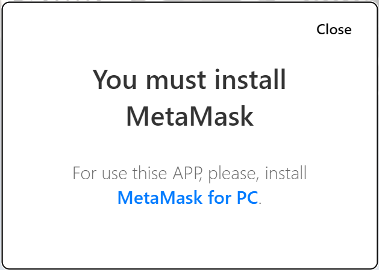
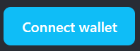
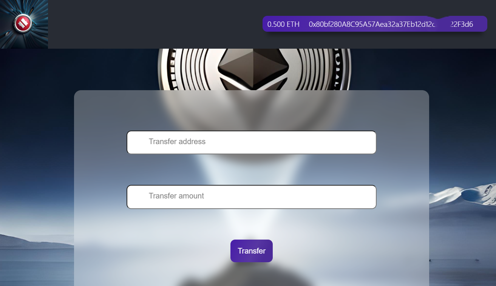

# ⭐My-wallet-app⭐

# Vite + React + JavaScript App



This is a simple React JavaScript application developed using the white app approach. The project uses the popular Ethereum wallet, Metamask, for transaction handling and interaction with Ethereum's blockchain. It's designed to be clean, efficient, and easy to understand.

## Getting Started

To get a local copy up and running, follow these steps:

1. Clone the repository

```bash
git clone https://github.com/qweeqer/my-wallet-app.git
```

2. Install the dependencies

```bash
npm install
```

3. Start the application

```bash
npm run dev
```

## Prerequisites

Before you begin, ensure you have Metamask installed on your browser. You will also need to create a wallet and connect it to this application.

Here are the steps to do this:

1. Install the [Metamask browser extension](https://metamask.io/download.html)

2. Create a wallet. Make sure to save the Secret Recovery Phrase in a secure place!

3. Connect your wallet to this application by clicking on the "Connect Wallet" button on the main page.



## Testing

To test the application, you will need to add some test Ether to your Metamask wallet. You can get this from the Sepolia Ethereum faucet:

[Sepolia Ethereum faucet](https://faucet.chainstack.com/sepolia-faucet)

If you need to test on Goerli Ethereum, you can get Ether from this faucet:

[Goerli Ethereum faucet](https://faucet.chainstack.com/goerli-faucet)

## Breakpoints

This application is designed to be responsive and includes the following breakpoints:

- 375px for mobile devices
- 768px for tablets
- 1280px for desktops

## The page template:



## Acknowledgements

This application would not be possible without the help of the Ethereum community and the contributors to the Metamask project.

## License

This project is licensed under the terms of the MIT license.
